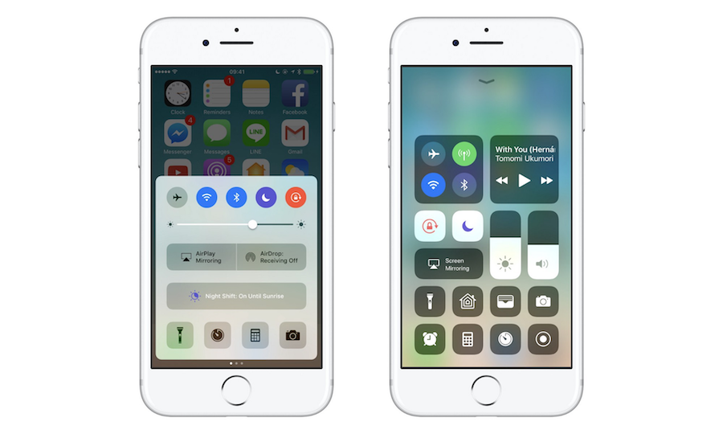

## 教程



```
OTA (Over the Air) 更新是指利用无线网络更新系统，禁用iOS设备上的 OTA 更新非常简单。只要按照下面提到的步骤：
```
#### 禁用OTA更新
1. 打开 Safari 并打开这个网址：[http://chinsyo.com/noota](http://chinsyo.com/noota)
2. 本网站将指向一个 iOS 配置文件，该配置文件将被下载到您的 iOS 设备，并在安装过程中提示您获得许可，允许安装。
3. 配置文件提取自 Apple TV 操作系统中，未加以修改。用于禁止 iOS 检查版本更新和自动下载更新补丁。
4. 配置文件安装完成后需重启设备以生效，重启后，导航到设置 -> 常规 -> 软件更新中不会看到更新提示。

#### 文件下载链接
* [iOS10 描述文件](https://raw.githubusercontent.com/chinsyo/noota/master/iOS10_NoOTA.mobileconfig)
* [iOS11 描述文件](https://raw.githubusercontent.com/chinsyo/noota/master/iOS11_NoOTA.mobileconfig)
* [iOS12 描述文件](https://raw.githubusercontent.com/chinsyo/noota/master/iOS12_NoOTA.mobileconfig)

---
## 提示

#### 关闭自动下载
如果您希望正常执行 OTA 检查更新，但不自动下载，只需导航到设置 -> iTunes Store 与 App Store，关闭自动下载的项目中「更新」。

#### 恢复OTA更新
如果您希望正常获得 OTA 更新，只需按照下面提到的步骤卸载您安装的描述文件即可。
* iOS11 之前，导航到设置 -> 通用 -> 设备管理。选择描述文件，然后点击「移除管理」。
* iOS11 之后，导航到设置 -> 通用 -> 描述文件。选择描述文件，然后点击「移除描述文件」。

#### 删除更新文件
如果您的 iPhone 已经下载了任何更新文件，只需按照下面提到的步骤卸载您安装的更新文件即可。
* iOS11 之前，导航到设置 -> 通用 -> 储存空间与 iCloud 用量，进入管理储存空间。选择 OTA 更新补丁，然后点击「删除」。
* iOS11 之后，导航到设置 -> 通用 -> iPhone 储存空间。选择 OTA 更新补丁，然后点击「删除」。

---
[给我写信](https://mail.qq.com/cgi-bin/qm_share?t=qm_mailme&email=lPf8-frn7fvU5eW69-v5)
